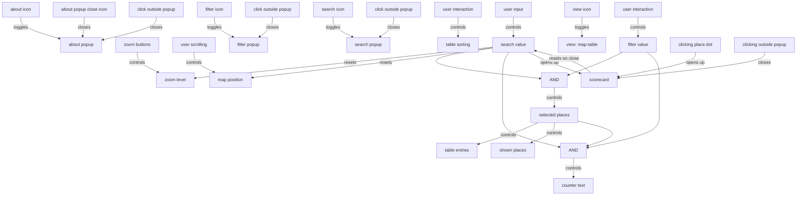

# Plant-based nudges map

This code runs the Nudge Map app for the Better Food Foundation: https://better-food-foundation.github.io/nudge-map/.

We do not use frameworks like React or Svelte to keep things simple. However, we do use these techniques:

- TypeScript
- Sass and the folder `src/css/theme`
- Reactive state management - see [State diagram](#state-diagram)

The main files are `index.html`, `src/js/main.ts`, and `data/*.json`. `main.ts` will load the JSON data to load all our data.

The database is stored in Directus and synced nightly to JSON to simplify how the app consumes the data.

## Developing the map app

Prerequisites:

1. Install [Node Package Manager (npm)](https://nodejs.dev/en/download/).

_If you are using Windows OS, install [Windows Subsystem for Linux (WSL)](https://learn.microsoft.com/en-us/windows/wsl/install). Currently, there are 2 versions out. WSL 1 will run npm **way** faster<sup>[1](https://stackoverflow.com/questions/68972448/why-is-wsl-extremely-slow-when-compared-with-native-windows-npm-yarn-processing)</sup>. You can switch to version 1 with `wsl --set-version Ubuntu 1`. Run all npm commands in wsl/Ubuntu._

2. Run `npm i` in the main folder.

### Start the development server

```bash
❯ npm start
```

Then open http://127.0.0.1:1234 in a browser. Hit `CTRL-C` to stop the development server.

When the server is running, you can make any changes you want to the project. Reload the page in the browser to see those changes. (You may need to force reload, e.g. hold the shift key while reloading on macOS.)

### Check type compilation

We write our code in TypeScript. The types are ignored when starting the server and running tests, but it's useful to manually check for any errors caught by TypeScript:

```bash
❯ npm run check
```

### Run tests

```bash
❯ npm test
```

If the tests are taking a long time to start or have unexpected failures, run `rm -rf .parcel-cache` and try the tests again.

### Autoformat code

We use Prettier to nicely format code.

```bash
❯ npm run fmt
```

Before pushing code, run this command and commit the changes. Otherwise, PR checks will not pass.

### Lint code

"Linting" means using tools that check for common issues that may be bugs or low code quality.

```bash
❯ npm run lint
```

### Try out a build locally

You can preview what a build will look like by running `npm run build`. Then use `npm run serve-dist` to start the server. A 'build' are the files sent for production on the real site. This is slightly different from the development server run by `npm start`, which prioritizes a quick start for development.

`npm run test-dist` will be implemented soon, while `npm test` is the development equivalent.

### Icons

All icons are inlined as an SVG sprite in [index.html](index.html#L43) using symbols from Font Awesome Free 6.7.2 (CC BY 4.0).

**Using an icon:**

In TypeScript, import `iconHtml()` or `createIcon()` from [src/js/layout/icons.ts](src/js/layout/icons.ts):

```typescript
import { iconHtml, createIcon, type IconName } from "./layout/icons";

// As HTML string (e.g., for setting innerHTML)
const html = iconHtml("magnifying-glass");
element.innerHTML = html;

// As a DOM element
const icon = createIcon("magnifying-glass", "my-class");
element.appendChild(icon);
```

**Adding a new icon:**

1. Choose an icon from [Font Awesome Free 6.7.2](https://fontawesome.com/icons) (only Free tier icons are permitted).
2. Download or copy the SVG path data (the `d="..."` attribute).
3. Add a new `<symbol>` in [index.html](index.html#L43) with `id="icon-{name}"`:

   ```html
   <symbol id="icon-my-icon" viewBox="0 0 512 512">
     <path fill="currentColor" d="..." />
   </symbol>
   ```

4. Add the icon name to the `IconName` type in [src/js/layout/icons.ts](src/js/layout/icons.ts).

## Staging

We use continuous deployment, meaning that we re-deploy the site every time we merge a pull request to https://better-food-foundation.github.io/nudge-map/. You can check how the site renders about ~1-2 minutes after your change merges.

## Updating the data

You usually should not need to manually do this. We will have a GitHub Action that runs every night to open a PR with any updates.

To instead manually update the data, first run `npm install`. Then, run `npm run sync-directus`.

## State diagram

This shows all possible user interactions on the map, and what triggers what.



We use reactive programming for state management. See https://github.com/ParkingReformNetwork/parking-lot-map/blob/main/README.md#state-diagram for an explanation.
